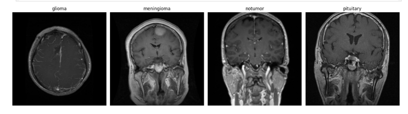
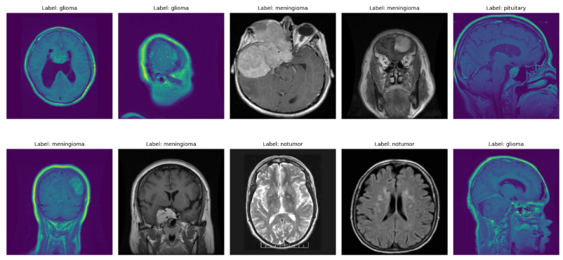
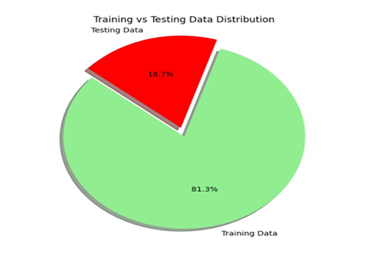
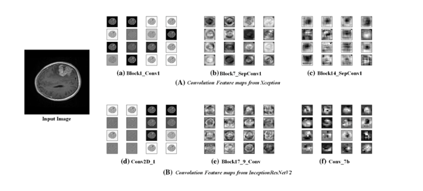
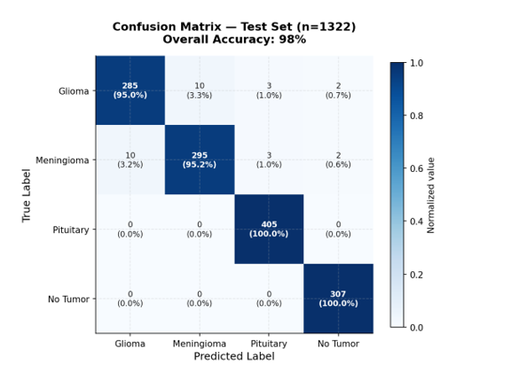
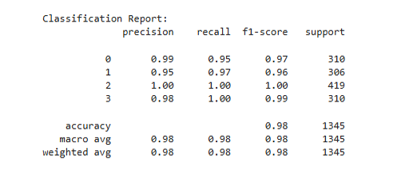
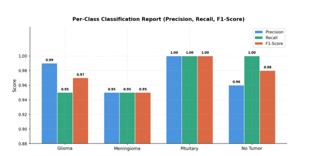
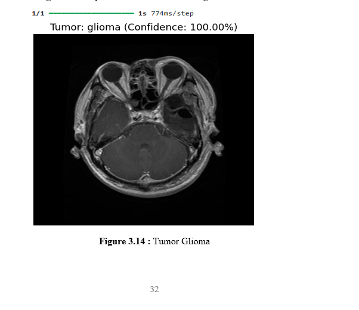
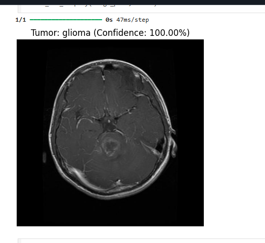

# 🧠 Brain Tumor Detection using Deep Learning (VGG16)

A deep learning project focused on automated brain tumor classification and detection using MRI scans. This repository utilizes a fine-tuned **VGG16** convolutional neural network architecture to accurately classify brain scans into four distinct categories: **Glioma, Meningioma, Pituitary tumor, and No Tumor**.

---

## 📊 Dataset & Exploratory Analysis
The dataset contains structural brain MRI scans categorized across the target classes. 

### 1. Types of Tumors & Sample Views
<p align="center">
  
</p>
<p align="center">
  
</p>

### 2. Dataset Distributions
<p align="center">
  
  
</p>

---

## ⚙️ Model Architecture & Training
Feature extraction and training progress over 25 epochs:
<p align="center">
  
</p>
<p align="center">
  
</p>

---

## 📈 Evaluation & Performance Metrics

### 1. Confusion Matrix
<p align="center">
  
</p>

### 2. Classification Reports & Performance
<p align="center">
  
  
</p>

---

## 💡 Sample Predictions & Inference
<p align="center">
  
  
</p>

---

## 🚀 Getting Started

### Prerequisites
Install the required dependencies:
```bash
pip install tensorflow keras numpy pandas matplotlib seaborn scikit-learn
